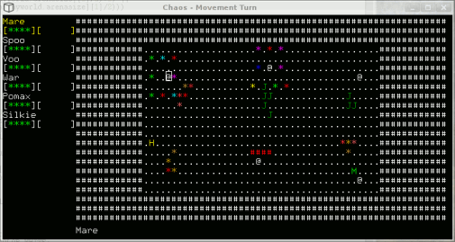

# Chaos

## What
A hopeful clone of the great game of Chaos by Julian Gollop ( http://www.worldofspectrum.org/infoseekid.cgi?id=0000894 ) recreated and extended for upto 12 players.

Note that this was my tool for learning C, ncurses and networking, so expect some jankyness.

Requirements:
* GNU-Make
* X11/Xorg (optional)
* NCurses (optional)
* Hildon/GTK+ (optional)

Needs at least one (optional) frontend ;)

## Compile
	gmake

## Usage
	./chaos

### Options
	-l<x>        (debug logging level 1-4)
	-f<frontend> (frontend = x11/ncurses)
	-n           (enable networking)
	-s<x>        (connect to server)
	-d           (dedicated server mode)
	-p<x>        (network port)

### Controls
	F4  - Debug Line of Sight
	F5  - Normal View
	F6  - History View
	F7  - Chat View (Only availible in Network Games)
	F8  - Debug View
	F9  - Change NCurses Cursor highlight mode.
	F10 - Give Hax (Quit).
	F11 - Debug Dump Spells.
	F12 - Debug Dump Arena.

	Movement
	--------
	Q W E      7 8 9
	A   D  or  4   6  or Cursor Keys
	Z X C      1 2 3

	S / 5 / Space - Select/Action
	K - Deselect
	0 - End Turn
	I - Info

## Network
	Default listen on port 13100.
